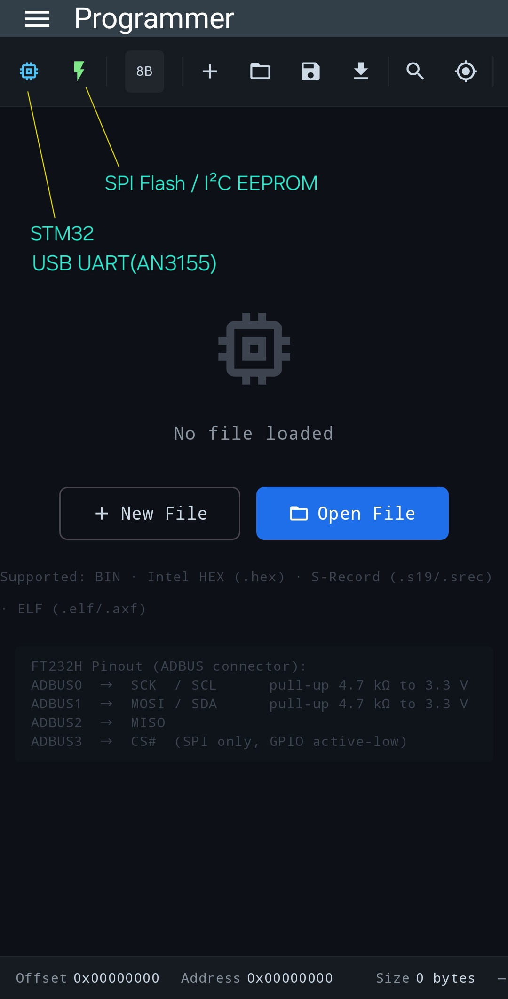

# Android-Programmer
Android programmer for SPI Flash and STM32 devices. Read, write and verify embedded memory.

## 📥 Download

Last updated: 2026-06-20

[Download 
EC-FusionKit-v1.13.4.apk](https://github.com/EmbeddedChan/Android-Programmer/raw/main/apk/EC-FusionKit-v1.13.4.apk)

This app is currently not available on Google Play.

The project is still under active development. Since I currently do not have the required hardware, I am looking for volunteers who can help test the app with real devices.
If you have compatible hardware, your feedback would be greatly appreciated. Please report any issues, compatibility results, or suggestions via GitHub or email.
Thank you for helping improve this project!

## 🖼 UI Preview

## 📦 Version History

### v1.13.4
- Initial release